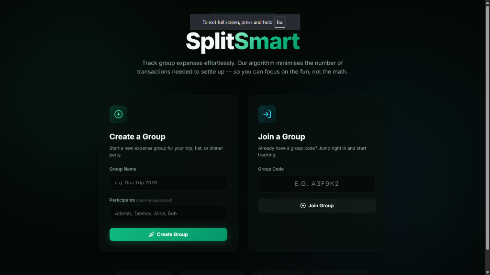
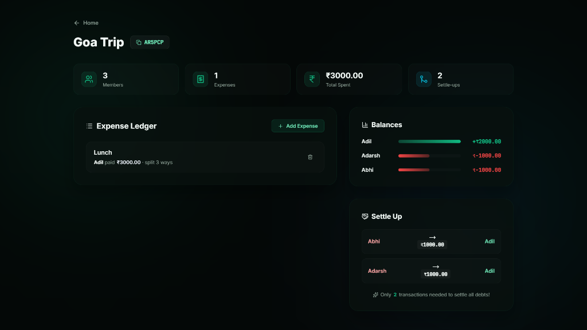
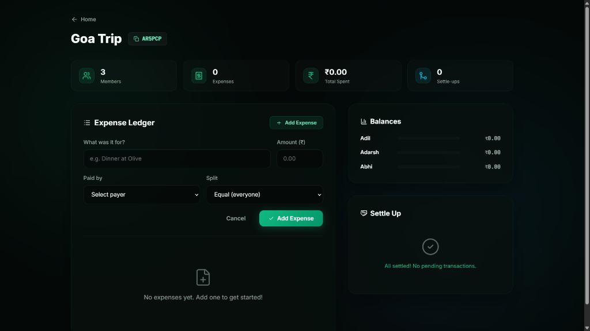

# SplitSmart 💸

SplitSmart is a full-stack, no-authentication group expense tracker. It models a group's expenses and simplifies debts using a **greedy max-heap-based settlement algorithm** (minimizing the number of transactions to settle all debts).

🔗 **Live Demo:** [https://split-smart-gules.vercel.app/](https://split-smart-gules.vercel.app/)

Featuring a premium **Forest Emerald & Mint Glassmorphic UI** design.

## 📸 Screenshots

### 🖥️ Landing Page


### 📊 Group Dashboard (with Ledger, Balances & Settle Up flow)


### ➕ Add Expense Form (Custom Splits)


---

## 🚀 Features

- **Frictionless Group Setup**: Create groups instantly. No login, sign-ups, or authentication required.
- **Smart Debt Simplification**: Computes the absolute minimum transactions needed to settle all debts in $O(K \log K)$ time.
- **Dynamic Splits**: Split expenses evenly among all members or select custom percentages/shares.
- **Instant Invite Link Sharing**: Copy-to-clipboard code sharing badges to easily onboard friends.
- **Responsive Theme**: Stunning dark-mode emerald theme, built with glassmorphic cards, custom percentage bars, and smooth transitions.

---

## 🛠️ Tech Stack

- **Backend**: Python, Flask, Flask-SQLAlchemy (relational mapping)
- **Database**: SQLite (local) / PostgreSQL (production)
- **Frontend**: HTML5, Vanilla JavaScript, CSS3 Custom Properties (Vanilla CSS)
- **Icons**: Lucide Icons
- **Deployment**: Vercel & Supabase ready

---

## 💻 Local Setup

1. **Clone the repository**:
   ```bash
   git clone https://github.com/adilnh-76/SplitSmart.git
   cd SplitSmart
   ```

2. **Install dependencies**:
   ```bash
   pip install -r requirements.txt
   ```

3. **Run the Flask development server**:
   ```bash
   python app.py
   ```
   Open your browser and navigate to `http://127.0.0.1:5000`.

---

## 🌐 Production Deployment

This project is configured out-of-the-box for **Vercel** serverless hosting and a cloud PostgreSQL database like **Supabase**.

For detailed step-by-step instructions on deploying the application to Vercel + Supabase, please see [implementation_report.md](./implementation_report.md).
